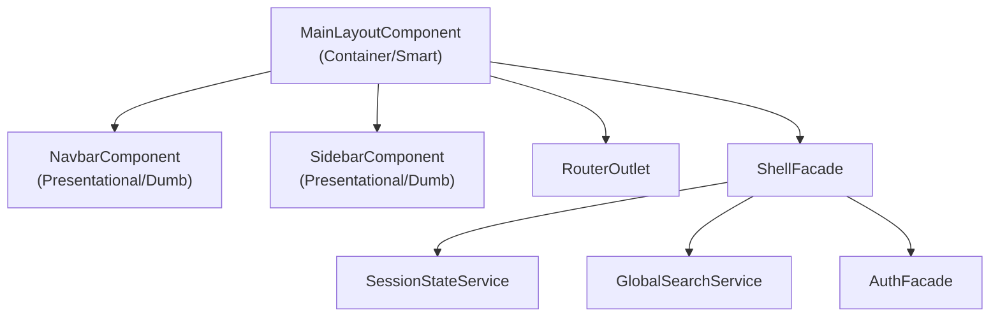

# 🏗️ Auditoría Profunda — Módulo `/src/app/shell`

> Auditoría realizada usando como estándar las skills: `angular-best-practices`, `angular-clean-architecture`, `angular-ui-patterns`, `angular-state-management`, `angular-testing`.

---

## 🔴 Problemas Críticos

---

### 1. `NavbarComponent` viola DIP — lógica de negocio directa en un componente de UI

**Archivos:** [navbar.component.ts](file:///home/enigma/Documentos/Refaccionaria/FrontTRT/src/app/shell/components/navbar/navbar.component.ts)

**Problema:** El `NavbarComponent` inyecta directamente `AuthFacade`, `Router` y `GlobalSearchService` y ejecuta lógica de negocio dentro del componente:

```typescript
// Líneas 47-49 — inyección directa
private readonly authFacade = inject(AuthFacade);
private readonly router = inject(Router);
private readonly globalSearchService = inject(GlobalSearchService);

// Líneas 59-66 — lógica de negocio en componente de UI
onLogout(): void {
  this.authFacade.logout();
  void this.router.navigate([AppRoutes.login]);
}

onSearchChange(query: string): void {
  this.globalSearchService.setSearchQuery(query);
}
```

**Por qué es un problema:**

- El navbar es un componente de **capa de presentación estructural** (shell). Según `angular-clean-architecture`, la presentación **solo debe delegar al Facade** y nunca contener lógica de negocio.
- Según `angular-ui-patterns`, un componente presentational solo debe tener `input()` / `output()` signals, sin servicios inyectados que no sean de UI.
- Esto crea un **acoplamiento fuerte** entre el shell y `@features/auth` — una violación de boundaries de Clean Architecture.

**Principio violado:** DIP, SRP, Clean Architecture (la capa shell no debe depender directamente de features)

**Cómo solucionarlo:** Convertir `NavbarComponent` en un componente **puramente presentational** y mover toda la lógica a `MainLayoutComponent` (container) o a un `ShellFacade`:

```typescript
// ✅ navbar.component.ts — SOLO presentational
@Component({
  selector: "app-navbar",
  standalone: true,
  changeDetection: ChangeDetectionStrategy.OnPush,
})
export class NavbarComponent {
  readonly username = input.required<string>();
  readonly currentDate = input.required<string>();
  readonly profileIconPath = input("user");
  readonly notificationsIconPath = input("bell");

  readonly profileClick = output<void>();
  readonly notificationsClick = output<void>();
  readonly logoutClick = output<void>(); // ← NUEVO output
  readonly searchChange = output<string>(); // ← NUEVO output
}

// ✅ main-layout.component.ts — CONTAINER maneja lógica
export class MainLayoutComponent {
  private readonly shellFacade = inject(ShellFacade);

  onLogout(): void {
    this.shellFacade.logout();
  }
  onSearch(query: string): void {
    this.shellFacade.setSearchQuery(query);
  }
}
```

---

### 2. Notificaciones hardcodeadas en template del navbar

**Archivos:** [navbar.component.html](file:///home/enigma/Documentos/Refaccionaria/FrontTRT/src/app/shell/components/navbar/navbar.component.html#L40-L51)

**Problema:** Las notificaciones están completamente hardcodeadas en el HTML:

```html
<!-- Líneas 41-46 -->
<app-dropdown-item icon="circle-alert"> Stock bajo: Traje negro </app-dropdown-item>
<app-dropdown-item icon="circle-alert"> Pedido pendiente </app-dropdown-item>
```

**Por qué es un problema:**

- No es escalable ni extensible (viola **OCP**)
- Imposible de testear dinámicamente
- Mezcla datos con presentación
- Cuando se integre un servicio de notificaciones real, habrá que reescribir todo este bloque

**Principio violado:** OCP, SRP, separación config vs state

**Cómo solucionarlo:** Las notificaciones deben llegar como `input()` desde el container:

```typescript
// sidebar-nav-item.model.ts (o notification.model.ts)
export interface Notification {
  readonly id: string;
  readonly icon: string;
  readonly message: string;
  readonly type: 'alert' | 'info';
}

// navbar.component.ts
readonly notifications = input<readonly Notification[]>([]);
```

```html
<!-- navbar.component.html -->
@for (notification of notifications(); track notification.id) {
<app-dropdown-item [icon]="notification.icon"> {{ notification.message }} </app-dropdown-item>
} @empty {
<app-dropdown-item>Sin notificaciones</app-dropdown-item>
}
```

---

### 3. `DATE_FORMATTER` duplicado en `NavbarComponent` y `MainLayoutComponent`

**Archivos:**

- [navbar.component.ts:33-37](file:///home/enigma/Documentos/Refaccionaria/FrontTRT/src/app/shell/components/navbar/navbar.component.ts#L33-L37)
- [main-layout.component.ts:16-20](file:///home/enigma/Documentos/Refaccionaria/FrontTRT/src/app/shell/layouts/main-layout/main-layout.component.ts#L16-L20)

**Problema:** El mismo `Intl.DateTimeFormat` está definido en ambos archivos:

```typescript
// Aparece EXACTAMENTE IGUAL en ambos archivos
private static readonly DATE_FORMATTER = new Intl.DateTimeFormat('es-MX', {
  year: 'numeric',
  month: 'long',
  day: 'numeric',
});
```

**Por qué es un problema:**

- Viola **DRY** — código duplicado que se desincronizará inevitablemente
- El `NavbarComponent` define un default `currentDate` con su propio formatter, pero `MainLayoutComponent` le pasa `currentDate()` como input — el default en navbar nunca se usa en producción
- La fecha debería calcularse en **un solo lugar** (el container o un servicio)

**Principio violado:** DRY, SRP

**Cómo solucionarlo:**

1. Eliminar `DATE_FORMATTER` de `NavbarComponent` (es presentational, solo recibe datos)
2. Hacer `currentDate` un `input.required<string>()` en navbar
3. Mantenerlo solo en `MainLayoutComponent` o extraer a un util/pipe:

```typescript
// shared/utils/date-format.util.ts
export function formatDateMX(date: Date = new Date()): string {
  return new Intl.DateTimeFormat("es-MX", {
    year: "numeric",
    month: "long",
    day: "numeric",
  }).format(date);
}
```

---

### 4. `MainLayoutComponent` importa servicios de auth con ruta interna de feature

**Archivo:** [main-layout.component.ts:5](file:///home/enigma/Documentos/Refaccionaria/FrontTRT/src/app/shell/layouts/main-layout/main-layout.component.ts#L5)

**Problema:**

```typescript
import { SessionStateService } from "@features/auth/application/services/session-state.service";
```

**Por qué es un problema:**

- El módulo `shell` depende **directamente** de una ruta interna de `@features/auth`.
- Según `angular-clean-architecture`, las features deben exponer solo su API pública vía barrel files (`@features/auth`).
- Esto rompe los boundaries del dominio: si `auth` reorganiza internamente, `shell` se rompe.

**Principio violado:** DIP, encapsulamiento de feature, Clean Architecture boundaries

**Cómo solucionarlo:**

1. Exponer `SessionStateService` (o mejor, un `AuthFacade.username` signal) desde el barrel file de auth
2. Inyectar a través de una abstracción (port/facade) que `shell` consuma
3. Idealmente crear un `ShellFacade` que orqueste la comunicación:

```typescript
// shell/application/shell.facade.ts
@Injectable({ providedIn: "root" })
export class ShellFacade {
  private readonly sessionState = inject(SessionStateService); // vía barrel

  readonly username = this.sessionState.username;
  // ...más propiedades de UI state del shell
}
```

---

## 🟠 Problemas Importantes

---

### 5. No existen barrel files (`index.ts`) en el módulo shell

**Problema:** No hay ningún `index.ts` en `/src/app/shell/` ni en sus subdirectorios.

**Por qué es un problema:**

- Según `angular-clean-architecture` y `angular-best-practices`, los barrel files son obligatorios para definir la API pública del módulo
- Cualquier consumidor de shell importa rutas internas directamente
- Hace más difícil refactorizar la estructura interna

**Principio violado:** Encapsulamiento, Clean Architecture

**Cómo solucionarlo:**

```typescript
// shell/index.ts
export { MainLayoutComponent } from "./layouts/main-layout/main-layout.component";
export { NavbarComponent } from "./components/navbar/navbar.component";
export { SidebarComponent } from "./components/sidebar/sidebar.component";
export { SidebarNavItem } from "./components/sidebar/sidebar-nav-item.model";
```

---

### 6. `NavbarComponent` tiene default hardcodeado para `username`

**Archivo:** [navbar.component.ts:39](file:///home/enigma/Documentos/Refaccionaria/FrontTRT/src/app/shell/components/navbar/navbar.component.ts#L39)

```typescript
readonly username = input('Miguel Lara');
```

**Por qué es un problema:**

- El nombre de un desarrollador hardcodeado como default es un **smell** evidente
- Un componente presentational debería recibir datos **siempre** del exterior
- Si alguien usa `<app-navbar />` sin pasar username, mostrará "Miguel Lara"

**Principio violado:** SRP, correctitud de datos

**Cómo solucionarlo:**

```typescript
readonly username = input.required<string>(); // Sin default — fuerza al consumer a pasarlo
```

---

### 7. `sidebar-nav-item.model.ts` — `icon` tipado como `string` genérico

**Archivo:** [sidebar-nav-item.model.ts:4](file:///home/enigma/Documentos/Refaccionaria/FrontTRT/src/app/shell/components/sidebar/sidebar-nav-item.model.ts#L4)

```typescript
readonly icon: string;
```

**Por qué es un problema:**

- No hay type safety para nombres de iconos de Lucide
- Cualquier string es aceptado, incluyendo typos que no se detectan hasta runtime
- Si se cambia la librería de iconos, no hay errors en compile time

**Principio violado:** LSP (el modelo no refuerza sus invariantes), ISP

**Cómo solucionarlo:**

```typescript
import type { LucideIconData } from "lucide-angular/icons/types";

export interface SidebarNavItem {
  readonly id: string;
  readonly label: string;
  readonly icon: string; // Lucide no exporta un union type, pero documentar
  readonly route: string;
  readonly exact?: boolean;
  readonly disabled?: boolean;
  readonly badge?: string; // Para extensibilidad (e.g., contador de items)
}
```

> [!NOTE]
> Lucide Angular no exporta un union type de iconos. La mejor opción es documentar con JSDoc y confiar en el config de lucide-angular para registrar iconos.

---

### 8. Menú del profile en navbar — "Configuración" sin acción

**Archivo:** [navbar.component.html:22-24](file:///home/enigma/Documentos/Refaccionaria/FrontTRT/src/app/shell/components/navbar/navbar.component.html#L22-L24)

```html
<app-dropdown-item icon="settings"> Configuración </app-dropdown-item>
```

**Por qué es un problema:**

- El item no tiene handler `(action)` — es un dead element
- El usuario ve una opción de menú que no hace nada

**Cómo solucionarlo:** Añadir un output o deshabilitarlo hasta que esté implementado:

```html
<app-dropdown-item icon="settings" [disabled]="true"> Configuración (próximamente) </app-dropdown-item>
```

---

## 🟡 Mejoras Recomendadas

---

### 9. `sidebar-menu.config.ts` — no escalable para roles/permisos

**Archivo:** [sidebar-menu.config.ts](file:///home/enigma/Documentos/Refaccionaria/FrontTRT/src/app/shell/components/sidebar/sidebar-menu.config.ts)

**Problema:** La configuración es una constante plana sin soporte para:

- Filtrado por roles/permisos
- Submenús / grupos
- Badges dinámicos
- Items condicionales

**Cómo mejorarlo:**

```typescript
export interface SidebarNavItem {
  readonly id: string;
  readonly label: string;
  readonly icon: string;
  readonly route: string;
  readonly exact?: boolean;
  readonly disabled?: boolean;
  readonly badge?: string;
  readonly roles?: readonly string[]; // ← Filtrado por rol
  readonly children?: readonly SidebarNavItem[]; // ← Submenús
}

// El filtrado se hace en un ShellFacade, NO en el componente
```

---

### 10. Falta de `HostBinding` para `:host` en navbar

**Archivo:** [navbar.component.css](file:///home/enigma/Documentos/Refaccionaria/FrontTRT/src/app/shell/components/navbar/navbar.component.css)

**Problema:** No hay `:host { display: block; }` — el `<app-navbar>` por defecto es `display: inline`, lo que puede causar problemas de layout.

**Cómo solucionarlo:**

```css
:host {
  display: block;
}
```

> [!TIP]
> El `SidebarComponent` sí tiene `:host { display: block; }` — inconsistencia entre componentes del mismo módulo.

---

### 12. `sidebar.component.css` — hardcoded `#fff` en lugar de design tokens

**Archivo:** [sidebar.component.css:67](file:///home/enigma/Documentos/Refaccionaria/FrontTRT/src/app/shell/components/sidebar/sidebar.component.css#L67) y [sidebar.component.css:84](file:///home/enigma/Documentos/Refaccionaria/FrontTRT/src/app/shell/components/sidebar/sidebar.component.css#L84)

```css
.sidebar-link-active {
  color: #fff; /* ❌ hardcoded */
}
.sidebar-link-active .icon {
  color: #fff; /* ❌ hardcoded */
}
```

**Por qué es un problema:**

- Según `angular-ui-patterns`, todos los colores deben usar CSS custom properties (design tokens)
- Rompe dark mode y tematización

**Cómo solucionarlo:**

```css
.sidebar-link-active {
  color: var(--color-primary-contrast, #fff);
}
```

---

## 🧪 Testing

---

### 13. Tests superficiales — solo verifican "should create"

**Archivos:**

- [navbar.component.spec.ts](file:///home/enigma/Documentos/Refaccionaria/FrontTRT/src/app/shell/components/navbar/navbar.component.spec.ts)
- [sidebar.component.spec.ts](file:///home/enigma/Documentos/Refaccionaria/FrontTRT/src/app/shell/components/sidebar/sidebar.component.spec.ts)

**Problema:** Ambos specs solo tienen un test trivial:

```typescript
it("should create", () => {
  expect(component).toBeTruthy();
});
```

**Tests faltantes (según `angular-testing` skill):**

#### `NavbarComponent`

- ✅ Debería mostrar el nombre de usuario recibido como input
- ✅ Debería mostrar la fecha formateada
- ✅ Debería emitir `profileClick` al clickear perfil
- ✅ Debería emitir `logoutClick` al clickear cerrar sesión (post-refactor)
- ✅ Debería emitir `searchChange` al escribir en búsqueda

#### `SidebarComponent`

- ✅ Debería renderizar todos los nav items del input
- ✅ Debería aplicar `routerLinkActive` al item activo
- ✅ Debería renderizar items deshabilitados con `aria-disabled="true"`
- ✅ Debería mostrar el logo
- ✅ No debería renderizar links para items `disabled`

#### `MainLayoutComponent`

- ❌ **No tiene archivo de test** — no existe `main-layout.component.spec.ts`

#### `sidebar-menu.config.ts`

- ✅ Debería validar que todos los items tienen `id` único
- ✅ Debería validar que las rutas empiezan con `/`

---

### 14. Navbar test — mock de Router usa `navigateByUrl` pero código usa `navigate`

**Archivo:** [navbar.component.spec.ts:27](file:///home/enigma/Documentos/Refaccionaria/FrontTRT/src/app/shell/components/navbar/navbar.component.spec.ts#L27)

```typescript
// Mock
routerSpy = { navigateByUrl: jest.fn() } as unknown as jest.Mocked<Router>;

// Código real (navbar.component.ts:61)
void this.router.navigate([AppRoutes.login]); // ← usa navigate, no navigateByUrl
```

**Problema:** El mock no cubre el método real que se invoca. Si se testea `onLogout`, el test no capturaría la navegación.

---

## 🟢 Buenas Prácticas Detectadas

| Práctica                            | Dónde                  | Por qué está bien                                  |
| ----------------------------------- | ---------------------- | -------------------------------------------------- |
| `ChangeDetectionStrategy.OnPush`    | Todos los componentes  | Cumple con `angular-best-practices` §1             |
| `standalone: true`                  | Todos los componentes  | Sin NgModules innecesarios (§2)                    |
| `input()` / `output()` signals      | Navbar y Sidebar       | API moderna con signals (§5)                       |
| `readonly` en properties            | `SidebarNavItem` model | Inmutabilidad en modelos de UI                     |
| Uso de `track item.id` en `@for`    | Sidebar template       | Evita re-renders innecesarios (§6 performance)     |
| `@if`/`@for` control flow moderno   | Sidebar template       | Angular 17+ control flow (§4)                      |
| `role="banner"` en navbar           | Navbar template        | Semántica HTML correcta                            |
| `aria-label="Navegación principal"` | Sidebar template       | Accesibilidad en navegación                        |
| `aria-hidden="true"` en iconos      | Sidebar template       | Iconos decorativos correctamente marcados          |
| `aria-disabled="true"` en items     | Sidebar template       | Items deshabilitados accesibles                    |
| Design tokens en CSS                | Navbar y Sidebar CSS   | Uso de custom properties (`--color-*`, `--font-*`) |
| `NgOptimizedImage` para logo        | Sidebar component      | Optimización de imágenes con `priority`            |
| `readonly SidebarNavItem[]`         | Sidebar config         | Array inmutable                                    |

---

## 🚀 Recomendaciones de Arquitectura

---

### A. Implementar separación Container vs Presentational



**Hoy:** `NavbarComponent` es un híbrido (tiene outputs pero también inyecta servicios).

**Target:**

- `NavbarComponent` y `SidebarComponent` → **100% presentational** (solo `input`/`output`)
- `MainLayoutComponent` → **Container** que inyecta el `ShellFacade` y pasa datos a los presentational

---

### B. Crear un `ShellFacade`

```typescript
// shell/application/shell.facade.ts
@Injectable({ providedIn: "root" })
export class ShellFacade {
  private readonly authFacade = inject(AuthFacade);
  private readonly sessionState = inject(SessionStateService);
  private readonly globalSearch = inject(GlobalSearchService);
  private readonly router = inject(Router);

  readonly username = this.sessionState.username;
  readonly notifications = signal<Notification[]>([]); // futuro servicio

  logout(): void {
    this.authFacade.logout();
    void this.router.navigate([AppRoutes.login]);
  }

  setSearchQuery(query: string): void {
    this.globalSearch.setSearchQuery(query);
  }
}
```

**Beneficios:**

- Desacopla shell de features
- Centraliza lógica de shell
- Fácil de testear
- Los componentes de UI quedan puros

---

### C. Externalizar y hacer escalable la configuración de menú

Mover `sidebar-menu.config.ts` a `shell/config/` y extender el modelo para soportar roles:

```
shell/
├── config/
│   └── sidebar-menu.config.ts   ← movido aquí
├── models/
│   ├── sidebar-nav-item.model.ts ← movido aquí
│   └── notification.model.ts     ← NUEVO
├── application/
│   └── shell.facade.ts           ← NUEVO
├── components/
│   ├── navbar/
│   └── sidebar/
└── layouts/
    └── main-layout/
```

---

## 🧩 BONUS — Mejoras específicas por componente

---

### `navbar.component`

1. **Eliminar** `AuthFacade`, `Router`, `GlobalSearchService` — hacerlo 100% dumb
2. **Agregar** `output` para `logoutClick` y `searchChange`
3. **Cambiar** `username` a `input.required<string>()`
4. **Eliminar** `DATE_FORMATTER` duplicado
5. **Convertir** notificaciones hardcodeadas en `input<Notification[]>`

### `sidebar.component`

1. ✅ Ya es prácticamente presentational — **bien hecho**

### `sidebar-menu.config.ts`

1. Mover a `shell/config/`
2. Agregar soporte para `roles`, `children`, `badge`
3. Usar `AppRoutes` para rutas en lugar de strings hardcodeados
4. Eliminar los comentarios TODO e implementar la feature mostrando la
   el contenido en blanco si es que no hay UI

### `sidebar-nav-item.model.ts`

1. Mover a `shell/models/`
2. Añadir propiedades opcionales: `badge`, `roles`, `children`

### `main-layout.component`

1. **Promover** a container: inyectar `ShellFacade` y pasar datos a navbar/sidebar
2. **Eliminar** import directo de `SessionStateService` — usar facade
3. **Crear** `main-layout.component.spec.ts` (actualmente no existe)
4. **Agregar** skip link para accesibilidad: `<a href="#main-content" class="skip-link">`
